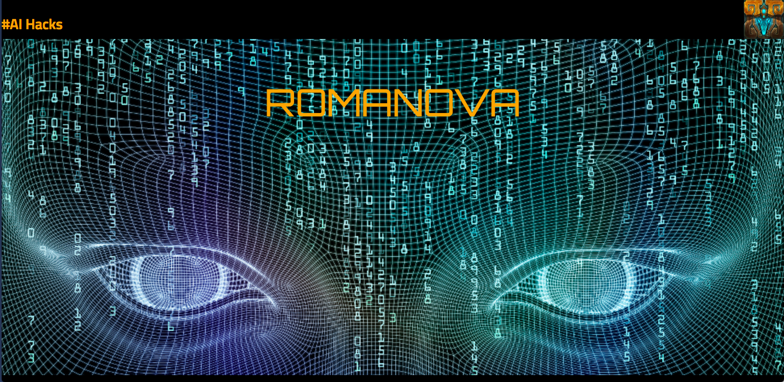

## Romanova (General Assembly Hackathon)
A 12 hour hackathon in teams of four. We were given the theme of Machines vs Hum
anity where we develop applications that help bring the apocolopyse of Artificia
lly Intelligent Robots.
Romanova is an AI-based web app that when given a picture selects humans to kill
, but if the humans are programmers they get to live.


## Code Example
Using the Clarifai API we were able to manipulate the JSON file, by using the ta
gs to distinguish what kind of model an image is based on the models we've alrea
dy trained.

```python
@app.route('/model')
def model():
    imgUrl = request.args.get('imgUrl')

    tags = api.predictModel(model_id=model_id, objs=[Image(url=imgUrl)])

    value_dict = {}
    for tag in tags['outputs'][0]['data']['tags']:
        id = tag['concept']['id']
        value = tag['value']
        value_dict[id] = value

    routine = get_routine(value_dict)

    return json.dumps(routine)
```
Here's a more in depth guide
[quickstart](http://flask.pocoo.org/docs/0.11/quickstart/)

## Installation and Testing

```shell
git clone https://github.com/HecticHiccups/Romanova
export=FLASK_APP=main.py
flask run main.py
```
This should get your Romanova web app up on your localhost, you can test out the functionality by uploading your custom photos from the localhost. To see generated values
open up developer tools for your browser and view objects from console. The output would be an array of Strings to be displayed on screen with uploaded picture in background.

## Clarifai API
We use the Clarifai API that handles image and video recognition; uses underlying machine learning mechanics made easily accessible. First we would load the images:
```python
img1 = Image(url='im_url_here',
             labels=['custom_label_here'])
```
add the images into the api

```python
api.addInputs([img1])
```
create a model and train it, where the tags are our classifiers

```python
res = api.createModel(model_name='civilian', concept_ids=['river', 'pool', 'dribble'])
```

Take a look at the [Clarifai API](https://developer.clarifai.com/guide/)
## Our Technologies Stack
Flask <br/>
Python <br/>
JavaScript <br/>
JQuery <br/>

## Team
**Backend** : Jonathan Portorreal <br />
**Backend** : Shannon C. O'Connor <br />
**Frontend** : Anthony Beltran <br />
**Fullstack** : Jesus
